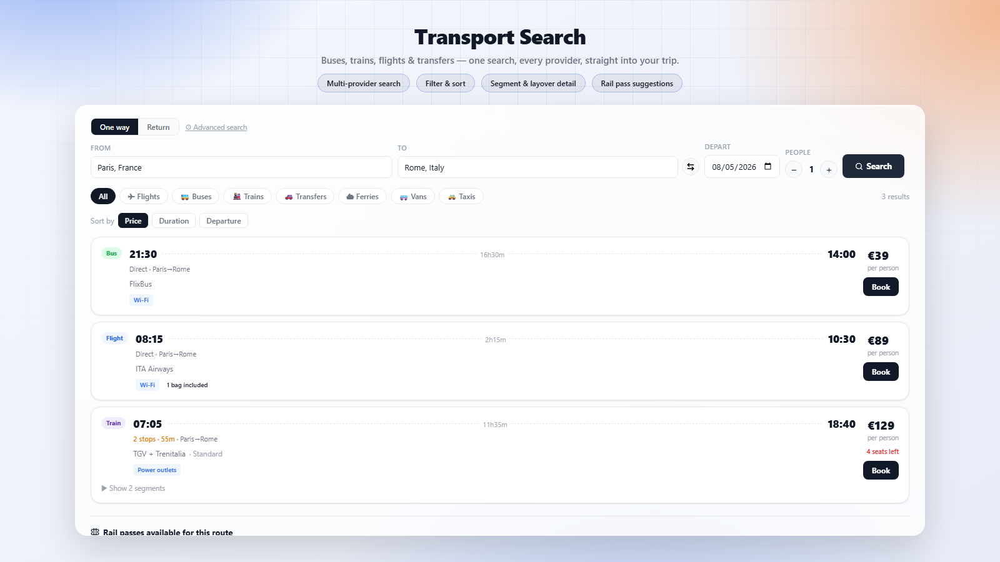

# Transport Search

Search buses, trains, flights and private transfers between any two places, right from inside a trip. Powered primarily by Traveling.com, with optional domestic-transit fallbacks for routes it covers thinly.

## What it does

Transport Search adds a **Transport** tab to every trip in TREK. Pick an origin and destination (autocompleted places), a departure date (and an optional return date), and search across every transport mode in one go — flights, buses, trains, private transfers, ferries, vans and taxis. Results can be filtered by mode and sorted by price, duration or departure time; multi-segment itineraries expand to show each leg and layover. European routes also surface relevant rail pass suggestions (e.g. Eurail/Interrail). Booking a result opens the provider's booking page, or saves the trip as a reservation on the trip.

When Traveling.com's coverage for a route is thin (a same-country domestic hop), the plugin can supplement results from country-specific or worldwide transit APIs — Trafiklab (Sweden), Rejseplanen (Denmark), Transitous, Google Routes, or Transitland — each opt-in via its own setting/API key.

## Screenshots

## Permissions

| Permission | Why it's needed |
|---|---|
| `db:own` | Stores the plugin's own working state in its private SQLite database. |
| `db:read:trips` | Reads the open trip's dates so date pickers stay within the trip's range. |
| `db:write:reservations` | Saves a chosen trip/flight as a reservation on the trip when you click "Save". |
| `rates:read` | Reads TREK's currency rates to show prices in a consistent display currency. |
| `http:outbound:traveling.com` | Primary search/booking provider — flights, buses, trains, transfers, ferries, vans, taxis. |
| `http:outbound:recheck10.12go.com` | Re-verifies live availability/price for Traveling.com (12Go-network) results before booking. |
| `http:outbound:recheck11.12go.com` | Same live re-check, alternate Traveling.com backend host. |
| `http:outbound:api.resrobot.se` | Optional Trafiklab (ResRobot) domestic transit search for routes within Sweden. |
| `http:outbound:www.rejseplanen.dk` | Optional Rejseplanen domestic transit search for routes within Denmark. |
| `http:outbound:transit.land` | Optional Transitland worldwide domestic transit fallback. |
| `http:outbound:routes.googleapis.com` | Optional Google Routes API worldwide domestic transit fallback. |
| `http:outbound:api.transitous.org` | Optional Transitous (free, community-run) worldwide domestic transit fallback, tried first when configured. |

## Setup

1. Install the plugin and activate it for your TREK instance; approve the requested permissions.
2. Open any trip and select the **Transport** tab.
3. Search works out of the box against Traveling.com — no configuration required.
4. Optionally, in the plugin's settings, add API keys/contact info to enable supplemental domestic-transit search where Traveling.com's coverage is thin:
   - **Trafiklab (ResRobot) API key** — free key from developer.trafiklab.se, for Swedish domestic routes.
   - **Rejseplanen API key** — key from labs.rejseplanen.dk, for Danish domestic routes.
   - **Transitous contact info** — a URL or email identifying you, required by Transitous's terms of use for their free worldwide routing service.
   - **Google Routes API key** — key from a billing-enabled Google Cloud project, for a worldwide fallback (capped at 9,000 requests/month by this plugin).

   Each source is independent and disabled by default until its key/contact is set.

## Note

Uses the Traveling.com public API and, optionally, third-party transit APIs. Results and availability may vary.
